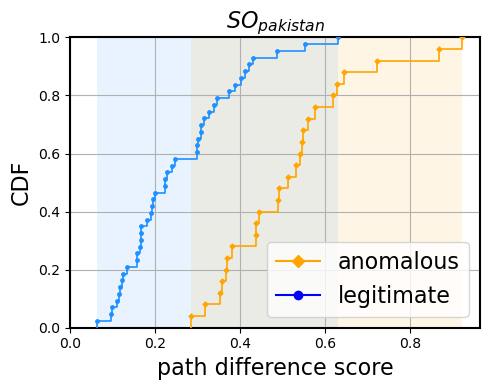

# Experiment to Analyze Historical Event

This experiment showcases how BEAM models can be used to evaluate the path difference of route changes, and how anomalous route changes exhibit significantly greater path difference than legitimate ones.

## Preliminary

Please follow the instructions of the main `readme.md` for environment setup.

## Get Started

Run `experiment/run.py` will

1. fetch the routing data temporally related with a known event.
2. detect all route changes within the time span.
3. extract the ground truth (legitimate/anomalous route changes).
4. evaluate the path difference of the ground-truth route changes, and plot the CDF curves.

See all available parameters with `--help`.

An example run is as follows:

```bash
python run.py --collector wide \
              --ev-code pakistan
```

which will generate a diagram like


