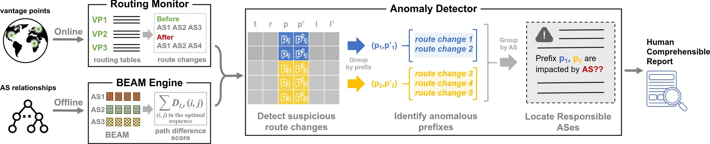

# Semantics-Aware Routing Anomaly Detection System

A demonstration codebase for the routing anomaly detection system featured in the USENIX Security 2024 [paper](https://www.usenix.org/conference/usenixsecurity24/presentation/chen-yihao), _Learning with Semantics: Towards a Semantics-Aware Routing Anomaly Detection System_, this repo is intended for research and demonstration purposes and may not be ready for production use. A full-featured, open-source version of the system, presumably including a public service, is currently under development; please see the [Future Work](#future-work) section for more information.

Contact: yh-chen21@mails.tsinghua.edu.cn

## System Overview



The system consists of three main modules:

-   **BEAM Engine** (`BEAM_engine/`): Uses AS business relationship data as input to train the BEAM model, which is used to quantify the path difference (abnormality) of route changes.

-   **Routing Monitor** (`routing_monitor/`): Takes BGP update announcements as input and outputs detected route changes.

-   **Anomaly Detector** (`anomaly_detector/`): Performs anomaly detection on the route changes and conducts correlation analysis on detected anomalous routing changes, outputting anomaly alarms.

A post-processing module (`post_processor/`) is additionally introduced for anomaly inspection and well-formatted HTML reports.

## Workflow

A typical workflow with this codebase is as follows:

1.  Train the BEAM model.
2.  Detect route changes from a window of routing data.
3.  Use the BEAM model to quantify the path difference of the route changes.
4.  Identify those with abnormally high path difference, aggregate them, and raise alarms.
5.  Generate a formatted anomaly report.

## Get Started

### 0. Prepare the environment

-   Python (>=3.8) is required, along with necessary packages. GPU and CUDA is recommended for model training.

    Set it up using Anaconda or Miniconda as follows:

    ```bash
    conda create -n beam python=3.8 numpy pandas scipy tqdm joblib click pytorch torchvision torchaudio pytorch-cuda=11.8 -c pytorch -c nvidia -y
    conda activate beam
    ```

-   The [BGPdump tool](https://github.com/RIPE-NCC/bgpdump) is required for parsing MRT-format BGP routing data.

    Build it from source, and link the binary to `$YOUR_REPO_PATH/data/routeviews/bgpd`, as follows:

    ```bash
    git clone https://github.com/RIPE-NCC/bgpdump.git
    cd bgpdump
    sh ./bootstrap.sh
    make
    ln -s $(pwd)/bgpdump $YOUR_REPO_PATH/data/routeviews/bgpd
    $YOUR_REPO_PATH/data/routeviews/bgpd -T # should print the test output
    ```

### 1. Train the BEAM model

Run `BEAM_engine/train.py` for model training. See all available parameters with `--help`.

An example run is as follows:

```bash
python train.py --serial 2 \
                --time 20240801 \
                --Q 10 \
                --dimension 128 \
                --epoches 1000 \
                --device 0 \
                --num-workers 10
```

This example downloads the [CAIDA AS relationship data](https://publicdata.caida.org/datasets/as-relationships/) of serial-2, Aug. 1, 2024, to train a BEAM model for 1000 epoches, with the number of negative samples (`Q`) set to 10 and the embedding vector dimension (`d`) set to 128. Training is executed on device 0 (either CPU or GPU, depending on the machine), and up to 10 parallel workers are used for data processing.

Notes:

-   The CAIDA AS relationship data is updated monthly. A typical archive today contains approximately 500,000 AS relationship records and is around 1.5MB in size.

-   The required CAIDA data is downloaded upon first use and stored in either `data/caida_as_rel/serial-1/` or `data/caida_as_rel/serial-2/`. Alternatively, other sources can be used if they follow the same format.

-   The trained model is saved in a directory under `BEAM_engine/models/`, named according to the training parameters. This includes the trained embedding vectors (`link.emb`, `node.emb`, `rela.emb`).

-   For reference, on a dual-core Xeon E5-2650v4 with a GeForce RTX 2080 Ti, training for 1000 epoches takes about 10 hours, with peak memory usage within 10GB.

### 2. Detect route changes

Run `routing_monitor/detect_route_change_routeviews.py` for monthly route change detection. See all available parameters with `--help`.

An example run is as follows:

```bash
python detect_route_change_routeviews.py \
            --collector wide \
            --year 2024 \
            --month 8
```

This example downloads and identifies route changes with the BGP update announcements from the `wide` collector of [RouteViews](http://routeviews.org/), for the entire month of August, 2024.

Notes:

-   RouteViews maintains over 30 collectors, each of which archives BGP update announcements in [MRT format](https://www.rfc-editor.org/rfc/rfc6396) at approximately 15-minute intervals. BGPdump is called as a subprocess to load these data. Other sources of data can also be used if they adhere to the MRT format.

-   The required RouteViews data is downloaded upon first use and stored in a directory under `data/routeviews/updates/`, named after the chosen collector.

-   This script processes the routing data of an entire month sequentially, in an offline manner. A global routing table is maintained in a Trie structure to track the route changes. The results are stored in a directory under `routing_monitor/detection_result/`, named after the chosen collector. The results include the identified route changes and daily snapshots of the global routing table.

### 3. Quantify path difference

Run `anomaly_detector/BEAM_diff_evaluator_routeviews.py` for path difference evaluation on the monthly route changes. See all available parameters with `--help`.

An example run is as follows:

```bash
python BEAM_diff_evaluator_routeviews.py \
            --collector wide \
            --year 2024 \
            --month 8 \
            --beam-model 20240801.as-rel2.1000.10.128
```

This example uses the BEAM model trained in [Step 1](#1-train-the-beam-model) to evaluate the path difference of the route changes detected in [Step 2](#2-detect-route-changes).

Notes:

-   This script evaluates the path difference for route changes of an entire month sequentially, in an offline manner. The results are stored in `BEAM_metric/`, under the same parent directory as the route change directory of the chosen collector.

### 4. Detect anomalies

Run `anomaly_detector/report_anomaly_routeviews.py` to detect anomalies based on the path difference of route changes. See all available parameters with `--help`.

An example run is as follows:

```bash
python report_anomaly_routeviews.py \
            --collector wide \
            --year 2024 \
            --month 8
```

This example detects anomalies based on the route changes detected in [Step 2](#2-detect-route-changes) and their path difference evaluated in [Step 3](#3-quantify-path-difference).

Notes:

-   This script detects anomalies for route changes of an entire month sequentially, in an offline manner. The results are stored in `reported_alarms/`, under the same parent directory as the route change directory of the chosen collector.

-   The results include the anomaly alarms raised for each time window, in separate CSV files, as well as a JSON file describing the overall information of the month's detection. Each alarm contains the time window, prefixes, associated ASes, and corresponding anomalous route changes, all associated to a single anomaly.

### 5. Generate the report

Run `post_processor/alarm_postprocess_routeviews.py` to incorporate additional knowledge, e.g., RPKI states, for identifying properties associated with the generated alarms. See all available parameters with `--help`.

An example run is as follows:

```bash
python alarm_postprocess_routeviews.py \
            --collector wide \
            --year 2024 \
            --month 8
```

This example identifies properties associated with the alarms generated in [Step 4](#4-detect-anomalies).

Notes:

-   This script utilizes additional knowledge to identify several properties associated with the alarms, for better understanding of the anomalies. The results are stored in `reported_alarms.flags/`, under the same parent directory as the route change directory of the chosen collector.

-   Each alarm would be associated with the following properties:
    -   `subprefix_change`: the alarm includes route changes involving sub-prefixes.
    -   `origin_change`: the alarm includes route changes involving change of origin ASes.
    -   `origin_same_org`: the alarm includes origin changes where the different origin ASes are from the same organization.
    -   `origin_country_change`: the alarm includes origin changes where the different origin ASes are from different countries.
    -   `origin_connection`: the alarm includes origin changes where the different origin ASes are connected.
    -   `origin_different_upstream`: the alarm includes route changes where the path go through different upstream providers from the same origin.
    -   `origin_rpki_1`: the origin before the change is RPKI-valid.
    -   `origin_rpki_2`: the origin after the change is RPKI-valid.
    -   `unknown_asn_1`: the route before the change includes unknown ASN.
    -   `unknown_asn_2`: the route after the change includes unknown ASN.
    -   `reserved_path_1`: the route before the change includes reserved ASN.
    -   `reserved_path_2`: the route after the change includes reserved ASN.
    -   `non_valley_free_1`: the route before the change is non-valley-free.
    -   `non_valley_free_2`: the route after the change is non-valley-free.
    -   `none_rel_1`: the route before the change includes unknown links.
    -   `none_rel_2`: the route after the change includes unknown links.
    -   `as_prepend_1`: the route before the change includes prepended ASes.
    -   `as_prepend_2`: the route after the change includes prepended ASes.
    -   `detour_country`: the alarm includes route detouring through other countries.
    -   `path1_in_path2`: the route before the change is the subset of that after the change.
    -   `path2_in_path1`: the route after the change is the subset of that before the change.

After the properties are associated, run `post_processor/summary_routeviews.py` to generate an HTML report about the month's detection results. See all available parameters with `--help`.

An example run is as follows:

```bash
python summary_routeviews.py \
            --collector wide \
            --year 2024 \
            --month 8
```

This example will generate an HTML report and a JSON-line-format file from the alarms generated in [Step 4](#4-detect-anomalies).

Notes:

-   The HTML report is stored in `post_processor/html/`, and the JSON-line-format file is stored in `post_processor/summary_output/`.

-   The HTML report is self-contained, with necessary descriptions of the terms used.

## Future Work

**Updated on Sep. 13, 2024**:

A full-featured, open-source version of the anomaly detection system is under development, aimed at deployment in production environments such as ISPs, and potentially as a public service to monitor the Internet and issue BGP anomaly warnings. This includes plans to refactor key functions using the Rust programming language and package them as Crates for public access. The current organization of these components is as follows:

-   **In progress:** A module to synchronize routing data in real time from RouteViews, RIPE RIS, and self-operated or peering ASes, stored locally in a database.
    -   SQLite for local storage and management of routing data.
    -   Part of functions from BGPstream.
    -   Integration of BGPdump.
    -   KVM/Docker support for virtual routers.
-   **Pending:** A module to train BEAM models using the latest CAIDA AS relationship data.
-   **Pending:** A module to process real-time routing data and detect anomalies.
-   **Pending:** A website or app for displaying and analyzing detection results in real time.

---
